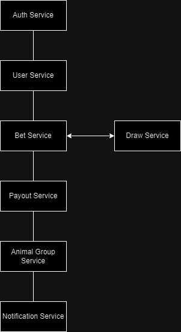

# Jogo do Bicho

Este é um projeto de pós-graduação desenvolvido em .NET para implementar o Jogo do Bicho. O sistema é composto por vários microsserviços que gerenciam diferentes partes do jogo, desde a autenticação de usuários até o processamento de apostas e pagamentos.

## Arquitetura

O sistema é composto pelos seguintes microsserviços:

- **Auth Service (Serviço de Autenticação)**: Gerencia a autenticação e autorização dos usuários.
- **User Service (Serviço de Usuários)**: Gerencia informações dos usuários, como perfil, saldo e histórico de apostas.
- **Bet Service (Serviço de Apostas)**: Gerencia as apostas dos usuários.
- **Draw Service (Serviço de Sorteios)**: Gerencia os sorteios dos números e animais.
- **Payout Service (Serviço de Pagamentos)**: Calcula e processa os pagamentos das apostas vencedoras.
- **Animal Group Service (Serviço de Grupos de Animais)**: Gerencia os grupos de animais e seus respectivos números.
- **Notification Service (Serviço de Notificações)**: Envia notificações aos usuários sobre resultados de apostas, sorteios e outros eventos relevantes.

## Diagrama da Arquitetura

Aqui está um diagrama que ilustra a arquitetura dos microsserviços:



## Regras do Jogo

### Apostas Simples (Grupo/Animal)
- O usuário escolhe um grupo/animal.
- Se algum dos números do grupo escolhido for sorteado em qualquer uma das cinco categorias, o usuário ganha 18 vezes o valor apostado.

### Apostas de Dezena
- O usuário escolhe uma dezena entre 00 e 99.
- Se a dezena escolhida aparecer na 1ª categoria do sorteio, o usuário ganha 60 vezes o valor apostado.

### Apostas de Centena
- O usuário escolhe um número de 3 dígitos.
- Se os três últimos dígitos do número escolhido aparecerem na 1ª categoria do sorteio, o usuário ganha 600 vezes o valor apostado.

### Apostas de Milhar
- O usuário escolhe uma sequência de 4 dígitos.
- Se a sequência escolhida aparecer em qualquer uma das cinco categorias, o usuário ganha 4000 vezes o valor apostado.

### Apostas de Duque de Dezena
- O usuário escolhe duas dezenas.
- Se ambas as dezenas escolhidas aparecerem ao longo das cinco categorias, o usuário ganha 300 vezes o valor apostado.

### Apostas de Terno de Dezena
- O usuário escolhe três dezenas.
- Se todas as três dezenas escolhidas aparecerem entre os cinco primeiros prêmios, o usuário ganha 3000 vezes o valor apostado.

### Apostas de Dupla de Grupo
- O usuário escolhe dois grupos de animais.
- Se pelo menos um dos números de cada grupo aparecer em uma das cinco categorias, o usuário ganha 18 vezes o valor apostado.

### Apostas de Terno de Grupo
- O usuário escolhe três grupos de animais.
- Se todos os três grupos aparecerem entre os cinco primeiros prêmios, o usuário ganha 130 vezes o valor apostado.

### Apostas de Quina de Grupo
- O usuário escolhe cinco grupos de animais.
- Se todos os cinco grupos aparecerem entre os cinco primeiros prêmios, o usuário ganha 5000 vezes o valor apostado.

## Tecnologias Utilizadas

- **.NET**: Framework principal para o desenvolvimento dos microsserviços.
- **SQL Server**: Banco de dados para armazenamento de dados.
- **RabbitMQ**: Serviço de mensageria para comunicação assíncrona entre os microsserviços.
- **Docker**: Contêineres para facilitar o desenvolvimento, teste e implantação dos microsserviços.
- **Swagger**: Documentação das APIs dos microsserviços.

## Como Executar

1. Clone o repositório:
   ```sh
   git clone https://github.com/babisque/AnimalDrawGame.git
   ```

2. Navegue até o diretório do projeto:
   ```sh
   cd AnimalDrawGame
   ```

3. Configure as variáveis de ambiente necessárias para cada microsserviço.

4. Construa e inicie os contêineres Docker:
   ```sh
   docker-compose up --build
   ```

## Contribuição

Sinta-se à vontade para contribuir com o projeto. Para começar, faça um fork do repositório e envie um pull request com suas alterações.

## Licença

Este projeto está licenciado sob a Licença MIT. Consulte o arquivo [LICENSE](LICENSE) para obter mais informações.